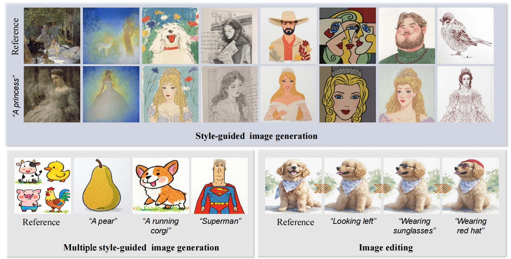

# 🎨 Sissi: Zero-shot Style-guided Image Synthesis via Semantic–style Integration
## 👀 Preview

- This is the official repository for the paper **Sissi: Zero-shot Style-guided Image Synthesis via Semantic–style Integration**.

  - In this work, we introduce a training-free framework that reformulates style-guided generation as an in-context learning task. Guided by textual semantic prompts, our method concatenates a reference style image with a masked target image, leveraging a pretrained ReFlow-based inpainting model to seamlessly integrate semantic content with the desired style through multimodal attention fusion.
  - 
## 📋 TODO & Coming Soon

**📄 The paper is currently under review. The following will be available upon acceptance.**

- [ ] Full source code.
- [ ] Easy-to-use inference script
- [ ] Installation instructions and requirements
- [ ] Colab demo notebook
- [ ] Comprehensive documentation
